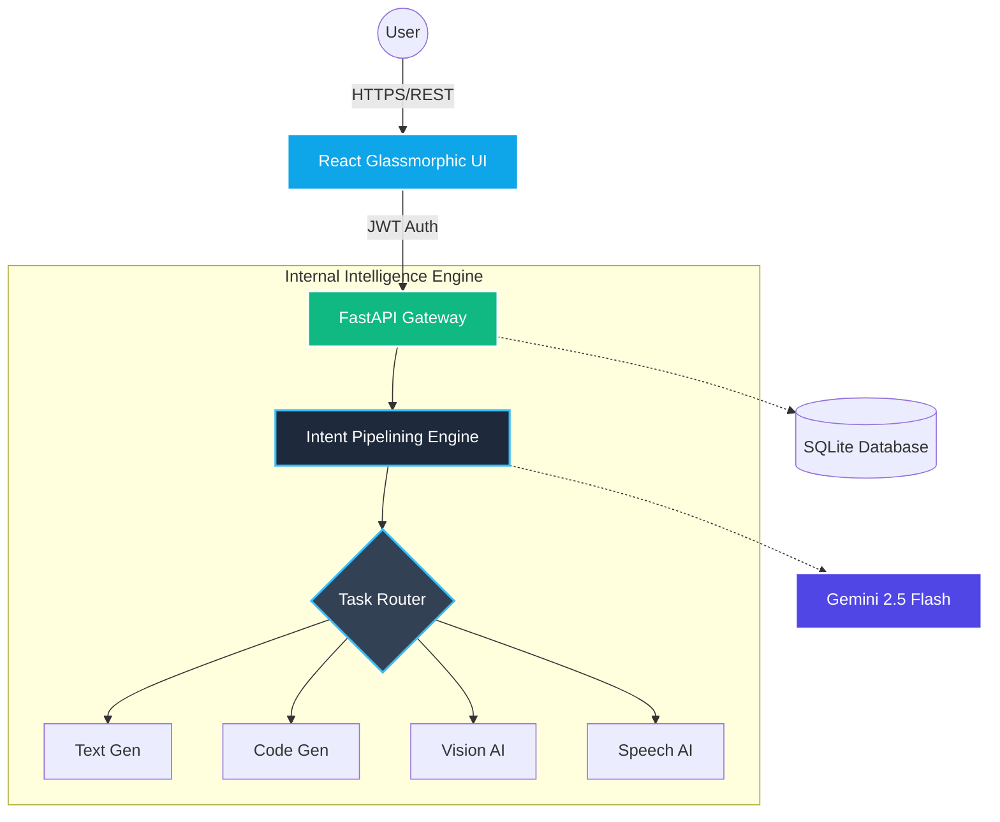
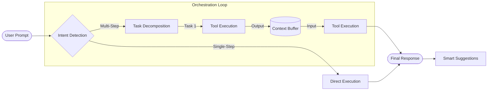

# <p align="center">✨ AI HUB — Multimodal Intelligence Platform ✨</p>

<p align="center">
  
  
  
  
</p>

<p align="center">
  <strong>The ultimate AI orchestration engine with a futuristic Glassmorphic UI.</strong>
  <br />
  <i>Empower your workflow with Vision, Speech, and Intelligent Task Pipelining.</i>
</p>

---

## 🌌 Project Overview

**AI Hub** is not just another chatbot. It is a high-performance **Multimodal Intelligence Platform** designed to handle diverse tasks through a unique **Circular Hub Interface**. Built with a focus on aesthetics and power, it uses **Google Gemini 2.5 Flash** to reason across text, images, and audio seamlessly.

### 🎯 Key Highlights
- **🎭 Glassmorphic UI:** A premium, translucent interface with interactive 3D-effect nodes.
- **🔄 Intent Pipelining:** Ask complex questions; AI Hub breaks them down into executable tasks.
- **📸 Vision Analysis:** Extract deep insights from images instantly.
- **🎙️ Live Transcription:** Real-time speech-to-text with a built-in terminal UI.
- **📑 Document Intelligence:** Instant summaries for PDF, DOCX, and Markdown files.

---

## 🚀 Interactive Features

### 🎡 The Circular Hub
A rotating, interactive dashboard where AI capabilities orbit a central core. Each "node" is a specialized tool:
1. **AI Assist Chatbot:** General reasoning and conversation.
2. **Text Generator:** High-quality creative and technical writing.
3. **AI Summarizer:** Surgical extraction of data from documents.
4. **Code Generator:** Expert-level code snippets with syntax highlighting.
5. **Image Analyzer:** Detailed visual description and object detection.
6. **Speech Recognition:** Native audio processing.
7. **Language Translator:** Polyglot support for global communication.

### 🧠 Smart Orchestration
The "Master Assistant" acts as a conductor. If you say: *"Explain this image and translate the summary to Kannada,"* AI Hub automatically:
1. Triggers **Vision Analysis**.
2. Passes the output to the **Summarizer**.
3. Feeds the final result into the **Translator**.

---

## 🖥️ Dashboard & How It Works

AI Hub features a high-fidelity **Circular Glassmorphic Dashboard**. Here is a breakdown of the interactive workflow:

### 🎡 The Interface at a Glance
The central "Core" acts as the gateway to the **Master Assistant**, while specialized tools orbit it for direct access.

| Component | Visual Identity | Primary Function |
| :--- | :---: | :--- |
| **Central Core** | 🔵 | Triggers the Multi-Step Orchestrator |
| **Tool Nodes** | ❄️ | Specialized single-task AI modules |
| **Live Terminal** | 📟 | Real-time speech-to-text feedback |
| **History Sidebar**| 📜 | Persistent storage of past AI insights |

### 🛠️ Step-by-Step Walkthrough

1.  **Authentication:** Secure login via JWT to access your personal AI workspace.
2.  **Input Selection:** 
    *   **Text:** Type complex natural language queries.
    *   **Upload:** Attach PDFs, DOCX, or Images for deep analysis.
    *   **Voice:** Use the "Speech Recognition" node for hands-free interaction.
3.  **Autonomous Routing:** The **Intent Pipelining Engine** analyzes your request and determines the optimal sequence of tools.
4.  **Multi-Step Execution:** Watch the AI work in real-time as it renders "Step Cards" for each completed sub-task.
5.  **Final Synthesis:** Receive a polished, multimodal response with the option to **Export as TXT**.

---

## 🛠️ Tech Stack

| Layer | Technologies |
|---|---|
| **Frontend** | React, Vite, Vanilla CSS (Glassmorphism), Prism.js |
| **Backend** | FastAPI (Python), Uvicorn, genai SDK |
| **AI Models** | Google Gemini 2.5 Flash (Multimodal) |
| **Persistence** | SQLite (aiosqlite), JWT Authentication |
| **Processing** | PyPDF2, python-docx, Pillow |

---

## 🏗️ System Architecture

AI Hub follows a decoupled architecture designed for high-performance AI orchestration.



---

## 🔄 AI Orchestration Workflow

The platform uses a unique **Intent Pipelining** flowchart to handle complex, multi-step requests.



---

## 🧠 Core Algorithms

### 1. Intent Pipelining (Task Decomposition)
*   **Algorithm:** Few-Shot Chain-of-Thought (CoT) Prompting.
*   **Logic:** The system utilizes a Master Assistant prompt to act as a **Natural Language Compiler**. It breaks down complex user inputs into a structured **Directed Acyclic Graph (DAG)** in JSON format, mapping specific intents to specialized tools.

### 2. Contextual State Injection
*   **Algorithm:** Iterative Buffer Management.
*   **Logic:** For multi-step tasks, the engine implements a stateful buffer. It captures the output of Task *N* and dynamically injects it as the input for Task *N+1*, enabling workflows like "transcribe audio → summarize text → translate to Hindi."

### 3. Spatial UI Mapping
*   **Algorithm:** Trigonometric Polar-to-Cartesian Transformation.
*   **Logic:** To achieve the circular hub interface, the frontend calculates node positions using `X = R * cos(θ)` and `Y = R * sin(θ)`. This is implemented via CSS custom properties and `calc()` for smooth rotations.

### 4. Cryptographic Security
*   **Algorithm:** Salted Bcrypt Hashing & HMAC-SHA256.
*   **Logic:** 
    *   **Bcrypt:** Uses an adaptive work factor (KDF) to protect user passwords against brute-force attacks.
    *   **JWT:** Implements stateless authentication by signing user payloads with a 256-bit secret key, ensuring session integrity without server-side state.

---

## ⚙️ Installation & Setup

### 📦 Prerequisites
- Python 3.9+
- Node.js & npm
- Gemini API Key ([Get it here](https://aistudio.google.com/))

### 🔧 Backend Configuration
1. Clone the repo and navigate to `backend/`.
2. Install dependencies:
   ```bash
   pip install -r requirements.txt
   ```
3. Create a `.env` file:
   ```env
   GEMINI_API_KEY=your_api_key_here
   JWT_SECRET=your_secure_secret
   ```
4. Start the engine:
   ```bash
   uvicorn main:app --reload
   ```

### 🎨 Frontend Configuration
1. Navigate to `frontend/`.
2. Install packages:
   ```bash
   npm install
   ```
3. Launch the dashboard:
   ```bash
   npm run dev
   ```

---

## 🤝 Connect with the Developer

Developed with ❤️ by **Gajanand Dhayagode**.

- **GitHub:** [@gajanand27-05](https://github.com/gajanand27-05)
- **Email:** [gajanandvd2005@gmail.com](mailto:gajanandvd2005@gmail.com)
- **Project Link:** [AI-HUB Repository](https://github.com/gajanand27-05/AI-HUB)

---

<p align="center">
  <i>"Building the future of AI orchestration, one node at a time."</i>
</p>
